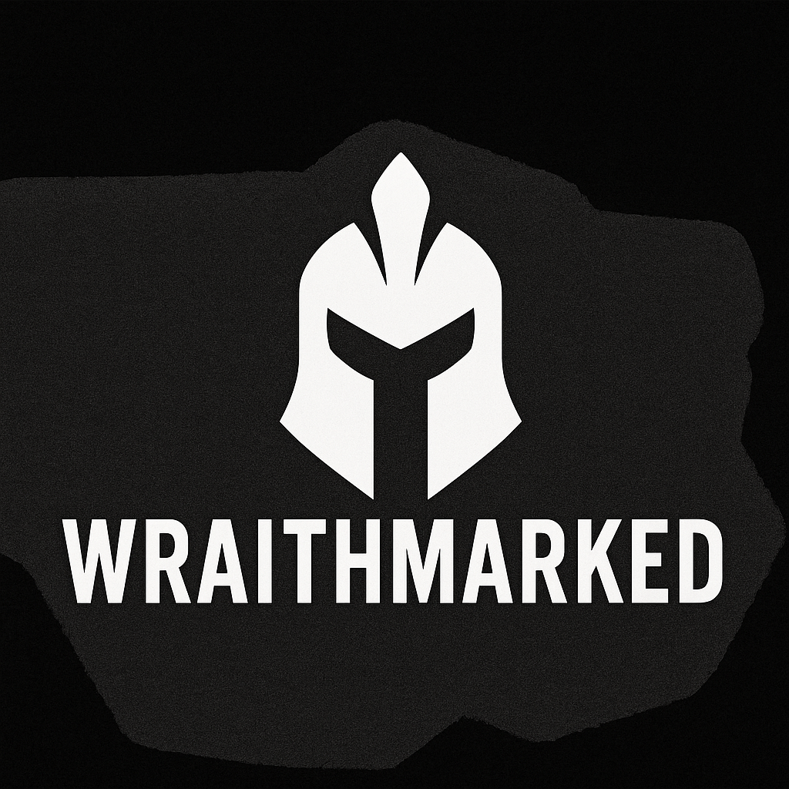

# WraithMarked


> _Crao: The one who deciphers chaos. The silent ghost in your code._



---

⚠️ **WARNING: EDUCATIONAL & ETHICAL USE ONLY** ⚠️

### DISCLAIMER: FOR EDUCATIONAL AND ETHICAL SECURITY RESEARCH ONLY

This project is a proof-of-concept agent designed for **authorized penetration testing**, cybersecurity research, and defensive tool development.
**Do not deploy or run this on any system you do not own or have explicit, written consent to monitor.** Unauthorized usage is strictly prohibited and may be illegal.

---

## Project Overview

**WraithMarked** is a minimal, stealth-first, cross-platform activity monitoring agent (RAT-style PoC) built in Rust. It focuses on silent system visibility while maintaining low overhead, using low-level system hooks for real-time insight collection.

This project aims to demonstrate practical techniques used in red teaming, adversary simulation, and digital forensics.

---

## Core Features

- Keystroke Logging – Captures global keyboard input
- Active Window Monitoring – Tracks currently focused application
- Autostart – Adds persistence via OS-specific startup routines
- Stealth Execution – No visible window or UI footprint
- Planned: Encrypted C2 communication
- Planned: Live screen preview capture
- Planned: Remote shell access & file system inspection

---

## Tech Stack

- **Rust** for safety, speed, and concurrency
- Libraries:

  - `rdev` – Input event capture
  - `x-win` – Window tracking
  - `chrono`, `serde`, `reqwest`, `tokio`, `log` – For scheduling, async telemetry, and system logging
  - `ctrlc` – For graceful process termination

---

## Development Roadmap

### Phase 1 – Core Agent

- [x] Keyboard and click input tracking
- [x] Active window capture
- [ ] Local data storage
- [ ] Autostart implementation
- [ ] Logging and graceful error handling
- [ ] Minimal local network telemetry

### Phase 2 – Remote Capabilities

- [ ] Secure Command & Control (C2) communication
- [ ] Remote shell & command execution
- [ ] File system browsing
- [ ] Live screen snapshots

---

## Getting Started

### Prerequisites

- [Install Rust](https://www.rust-lang.org/tools/install)

### Installation

```sh
git clone https://github.com/cyberstackpro/wraithmarked-agent.git
cd wraithmarked-agent
cargo build --release
```

---

## License

This project is dual-licensed under the MIT or Apache 2.0 license.

---

## Contribution & Feedback

If you're a security researcher, red teamer, or Rust developer interested in contributing features or C2 modules, feel free to open issues or pull requests.

---

_Stay invisible. Stay efficient. Stay ethical._
